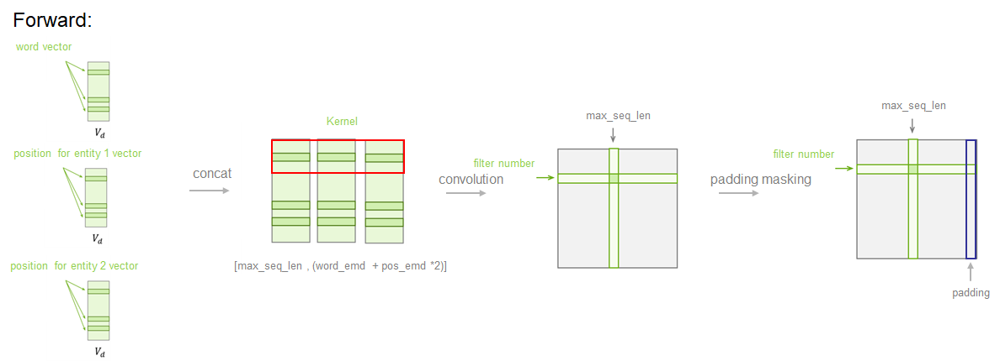
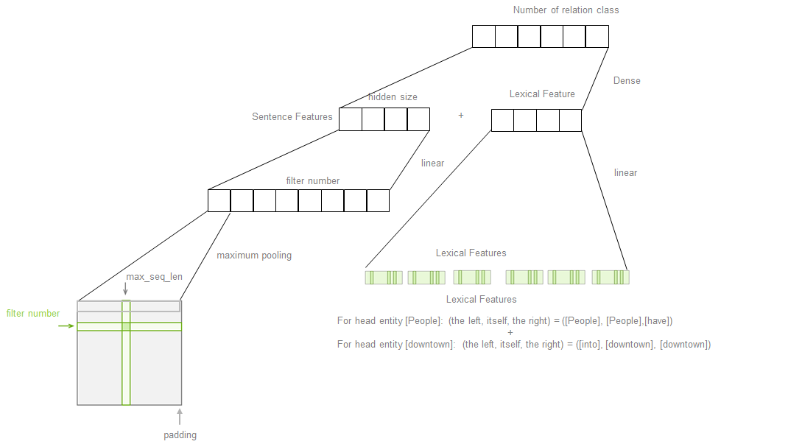

# Relation Classification via Convolutional Deep Neural Network

This repository is to implement the algorithm called Relation Classification via Convolutional Deep Neural Network.
There are three jupyter notebooks showining step by step how to implement that idea to do relation classification. 

### Model Strucuture with two foward steps:

Sentence Features Forword:

Sentence Features + Lexical Features Forword:

